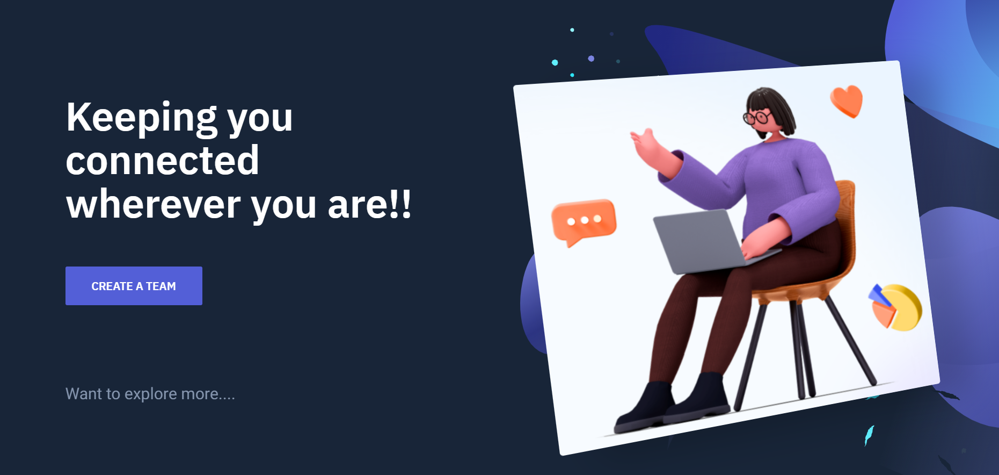
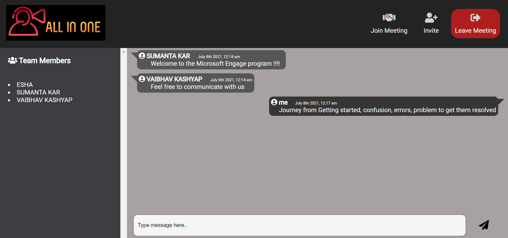
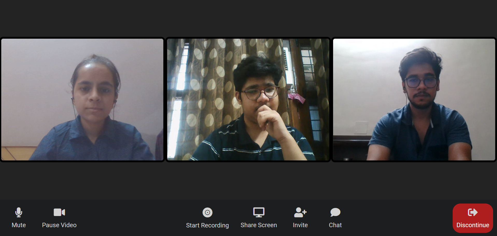
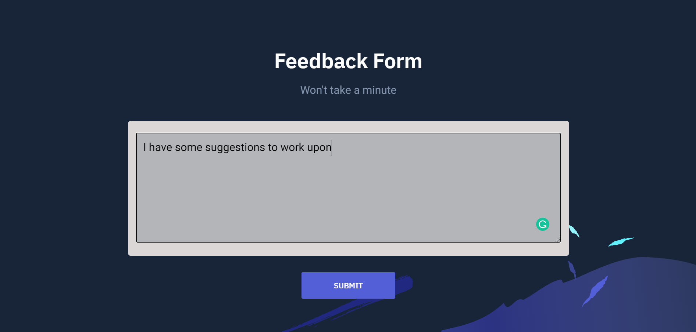

# ✨ Video-Conferencing-App  ✨

This is a conference call application where users can call other user with features of integrated the features of multiple participants, real-time video-audio communication,conversation over chat before, during and after the meeting without disrupting flow of the meeting, screen sharing, meeting recording, toggling of video/audio stream.

## This video conferencing application has been developed for the accomplishment of Microsoft Engage’21 Phase-2 challenge following agile methodology principles.

**Project Link** - https://video-conferencing-webapp.herokuapp.com/

**Demo Video** -  https://www.youtube.com/watch?v=e5gAgfXFh04

## Features and Functionalities 😃

- Video Call with multiple participants
- Chat feature working without disrupting flow of meeting
    - View & Send messages.
    - Continue the conversation after the meeting.
    - Start the conversation before the meeting.
- Toggling of video stream
- Toggling of audio stream (mute & unmute)
- Screen sharing
- Share link to join instantly on e-mailId
- Chat in real-time
- Screen Recording
- Unlimited duration calls
- Simple and intuitive UI

## Screenshots 📸
### First page -   

### Main Chat page -

### In video-conferencing-call -

### Feedback Page -

## Tech Stack 💻

- [Heroku (Hosting)](https://www.heroku.com)
- [Web RTC](https://github.com/webrtc)
- [Socket.io](https://socket.io/)
- [Node.js](https://nodejs.org/en/)
- HTML, CSS, Bootstrap
